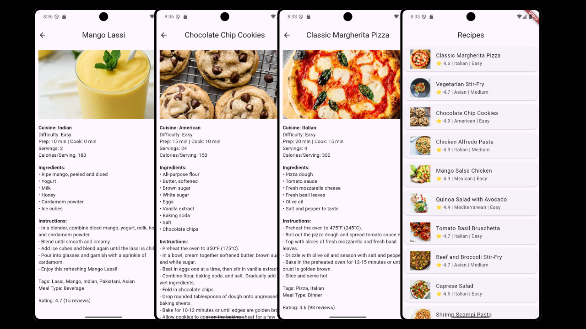

# 📱 Get Recipes Api

แอปพลิเคชัน Flutter สำหรับแสดง **รายการสูตรอาหาร** พร้อมรายละเอียด โดยดึงข้อมูลจาก [DummyJSON API](https://dummyjson.com/recipes)

## 🧩 ฟีเจอร์หลัก

- แสดงรายการสูตรอาหารพร้อมรูปภาพ
- แสดงคะแนนรีวิว ความยาก และประเภทอาหาร
- ดูรายละเอียดสูตรอาหารแบบเต็ม เช่น:
  - ส่วนผสม (Ingredients)
  - ขั้นตอนการทำอาหาร (Instructions)
  - เวลาที่ใช้ในการเตรียม / ปรุง
  - ปริมาณแคลอรี่ต่อเสิร์ฟ
  - ประเภทมื้ออาหาร (เช่น มื้อเย็น, ของว่าง)
- ดึงข้อมูลแบบออนไลน์ผ่าน HTTP API
- ใช้ `FutureBuilder` ในการจัดการสถานะโหลดข้อมูล
- UI เรียบง่าย ใช้งานง่าย ด้วย Material Design

## 🚀 เริ่มต้นใช้งาน

### 1. Clone โปรเจกต์

```bash
git clone <repository-url>
cd recipe-list-app
```

### 2. ติดตั้ง dependencies

```bash
flutter pub get
```

### 3. รันโปรเจกต์

```bash
flutter run
```

> ✅ รองรับ Android, iOS และ Web

---

## 🧑‍💻 โค้ดส่วนสำคัญ

### เรียกข้อมูลจาก API

```dart
Future<List<dynamic>> fetchRecipes() async {
  final response = await http.get(Uri.parse('https://dummyjson.com/recipes'));
  if (response.statusCode == 200) {
    final data = json.decode(response.body);
    return data['recipes'];
  } else {
    throw Exception('Failed to load recipes');
  }
}
```

### การแสดงผลรายการอาหาร

```dart
ListView.builder(
  itemCount: recipes.length,
  itemBuilder: (context, index) {
    final recipe = recipes[index];
    return Card(
      child: ListTile(
        leading: Image.network(recipe['image'], width: 60, height: 60, fit: BoxFit.cover),
        title: Text(recipe['name']),
        subtitle: Text('⭐ ${recipe['rating']} | ${recipe['cuisine']} | ${recipe['difficulty']}'),
        onTap: () {
          Navigator.push(
            context,
            MaterialPageRoute(
              builder: (_) => RecipeDetailPage(recipe: recipe),
            ),
          );
        },
      ),
    );
  },
)
```

### หน้ารายละเอียดสูตรอาหาร

```dart
Text('Cuisine: ${recipe['cuisine']}', style: const TextStyle(fontWeight: FontWeight.bold)),
Text('Prep: ${recipe['prepTimeMinutes']} min | Cook: ${recipe['cookTimeMinutes']} min'),
Text('Calories/Serving: ${recipe['caloriesPerServing']}'),

...List<Widget>.from(recipe['ingredients'].map((i) => Text('• $i'))),
...List<Widget>.from(recipe['instructions'].map((i) => Text('- $i'))),
```

---

## 🛠️ เทคโนโลยีที่ใช้

- [Flutter](https://flutter.dev/)
- [Dart](https://dart.dev/)
- [http](https://pub.dev/packages/http) – สำหรับเรียกข้อมูลจาก API
- Material Components

## 📸 ตัวอย่างหน้าจอ

- หน้าแสดงรายการสูตรอาหาร (ชื่อ, คะแนน, รูป, ความยาก)
- หน้าแสดงรายละเอียด (รูปเต็ม, ส่วนผสม, วิธีทำ, รีวิว ฯลฯ)

 
